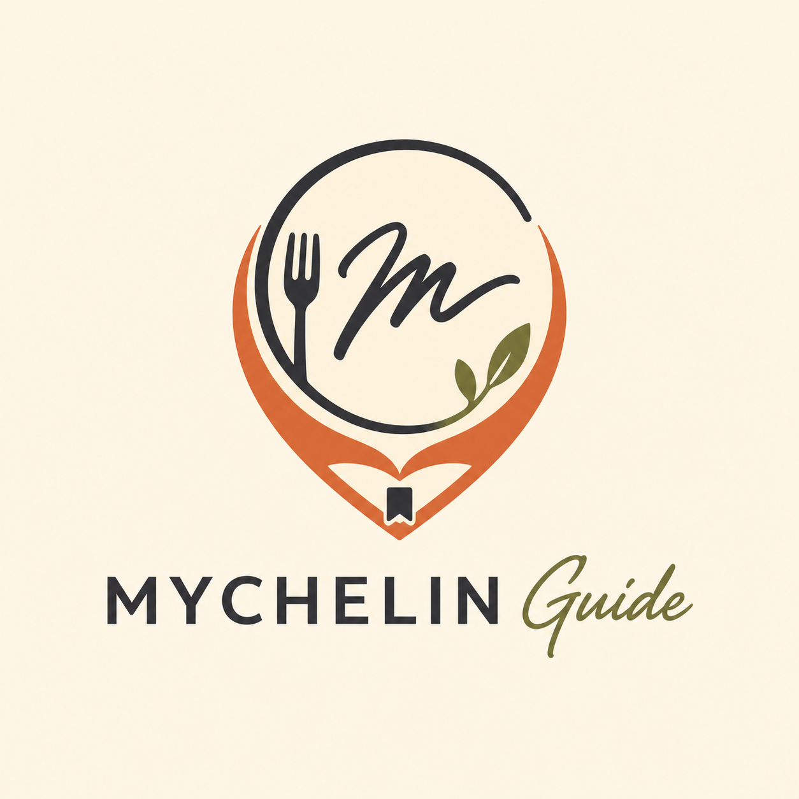

<p align="center">
  
</p>

<p align="center">
  <b>A React Native and Spring Boot app for rating menu items, tracking restaurant visits, and building a personal food guide.</b>
</p>

## MYCHELIN Guide

## Quick Start

### Prerequisites

- Node.js 24 LTS
- npm
- Eclipse Temurin JDK 25
- Git

#### Check Versions

```bash
node -v
npm -v
java -version
git --version
```

### 1. Clone the repository

```bash
git clone https://github.com/dldyou/mychelin-guide.git
cd mychelin-guide
```

### 2. Start mobile app

```bash
cd mobile
npm install
npm start
```

### 3. Start backend server

In a second terminal from the repository root:

Windows PowerShell:

```powershell
cd backend
.\gradlew.bat bootRun
```

macOS/Linux:

```bash
cd backend
./gradlew bootRun
```

Check that `http://localhost:8080/actuator/health` reports status `UP`.

## Verification

```powershell
cd mobile
npm test -- --runInBand
npx tsc --noEmit
npx expo export --platform web

cd ..\backend
.\gradlew.bat test
```

Physical-device release checks:

- Save a restaurant visit with a photo, restart the app, and confirm the data is restored.
- Confirm restaurant totals, scores, visit history, and the personal guide update together.
- Open the native share sheet and confirm repeated taps do not open duplicate sheets.
- Check the main flows with VoiceOver or TalkBack.
